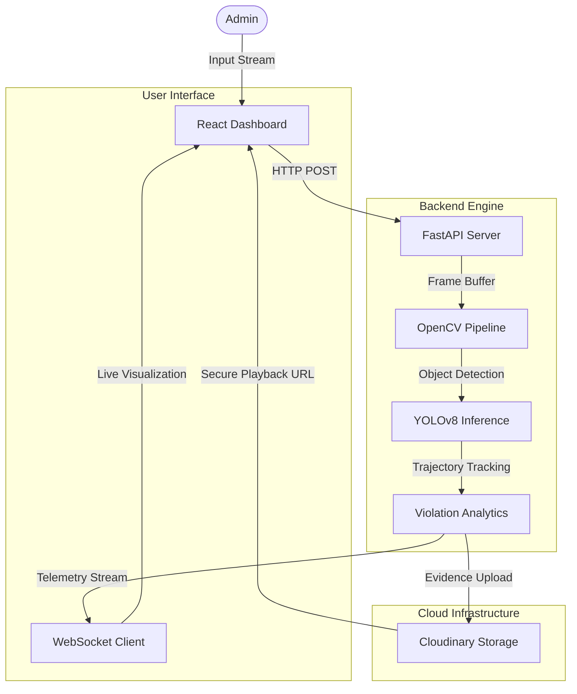

# TrafficGuard AI
### Enterprise Traffic Analytics & Violation Detection System


TrafficGuard AI is a production-grade traffic intelligence system capable of real-time vehicle tracking, flow analysis, and automated violation detection. Leveraging the YOLOv8 deep learning architecture and ByteTrack algorithm, it delivers forensic precision in identifying wrong-way driving incidents and traffic anomalies.

---

## Table of Contents

- [System Architecture](#system-architecture)
- [Core Capabilities](#core-capabilities)
- [Technical Stack](#technical-stack)
- [Project Navigation](#project-navigation)
- [Installation and Deployment](#installation-and-deployment)
- [Security and Compliance](#security-and-compliance)

---

## System Architecture

The solution implements a reactive hybrid architecture. Video streams are processed by an asynchronous Python inference engine which streams telemetry via WebSockets to a React-based visual dashboard.



---

## Core Capabilities

### AI Intelligence Engine
The system employs **Ultralytics YOLOv8** (Nano/Small variants) for high-frequency object detection, coupled with the **ByteTrack** algorithm. This combination allows for:
-   **Robust Tracking:** Maintains vehicle IDs across temporary occlusions.
-   **Multi-Class Detection:** Distinguishes between Cars, Trucks, Buses, and Motorcycles.
-   **Velocity Estimation:** Calculates relative speed and directional vectors.

### Violation Detection System
Automated logic monitors vehicle vectors against defined lane protocols.
-   **Instant Alerting:** Identifies wrong-way drivers within milliseconds of infraction.
-   **Evidence Preservation:** Automatically captures video clips and timestamps of violations.
-   **Cloud Integration:** Asynchronously uploads processed evidence to Cloudinary for permanent, secure storage.

### Forensic Reporting
-   **Real-time Metrics:** Displays traffic volume, turnover rates, and violation statistics live.
-   **CSV Export:** Generates legally compliant data logs containing precise timestamps, vehicle IDs, and class types.
-   **Visual Evidence:** "Smart Seek" functionality allows operators to instantly review specific violation events.

---

## Technical Stack

| Component | Technology | Role |
| :--- | :--- | :--- |
| **Backend Core** | Python 3.11+, FastAPI | API Handling and Async Task Management |
| **Computer Vision** | OpenCV, Ultralytics YOLOv8 | Image Processing and Neural Network Inference |
| **Frontend Framework** | React 18, Vite | Reactive User Interface |
| **State Management** | React Hooks | Real-time Data Handling |
| **UI Library** | Material-UI (MUI) V5 | Enterprise Design System |
| **Cloud Storage** | Cloudinary SDK | Scalable Media Storage |

---

## Project Navigation

| Directory | Type | Description |
| :--- | :--- | :--- |
| `backend/` | **Source** | Contains API server, inference logic, and cloud handlers. |
| `frontend/` | **Source** | Contains React application, components, and assets. |
| `backend/uploads/` | *Temporary* | buffer for incoming video streams (auto-cleared). |
| `backend/processed/` | *Temporary* | Output buffer for rendered videos before upload. |
| `backend/violations/` | *Temporary* | Snapshot storage for immediate UI feedback. |

> **Note:** The `postcss.config.js` file in the frontend directory is critical for CSS cross-browser compatibility. It ensures styles render correctly across different rendering engines.

---

## Installation and Deployment

### Prerequisites
-   **Python 3.10** or higher
-   **Node.js 18** or higher / NPM

### Backend Configuration

1.  Navigate to the backend directory:
    ```bash
    cd backend
    ```

2.  Install dependencies:
    ```bash
    pip install -r requirements.txt
    ```

3.  Configure Environment Variables:
    Create a `.env` file in the `backend/` root with the following credentials:
    ```env
    CLOUDINARY_CLOUD_NAME=your_cloud_name
    CLOUDINARY_API_KEY=your_api_key
    CLOUDINARY_API_SECRET=your_api_secret
    ```

4.  Start the Inference Server:
    ```bash
    python main.py
    ```

### Frontend Configuration

1.  Navigate to the frontend directory:
    ```bash
    cd frontend
    ```

2.  Install Node modules:
    ```bash
    npm install
    ```

3.  Launch the Dashboard:
    ```bash
    npm run dev
    ```

---

## Security and Compliance

This repository employs strict security configurations to ensure data integrity and credential safety.

> [!IMPORTANT]
> **Data Safety:** The `.gitignore` configuration explicitly excludes sensitive files such as `.env` and large media directories (`uploads/`, `processed_videos/`) from version control. This prevents accidental exposure of API keys and manages repository size.

---

### Copyright
&copy; 2025 TrafficGuard AI. All Rights Reserved.
