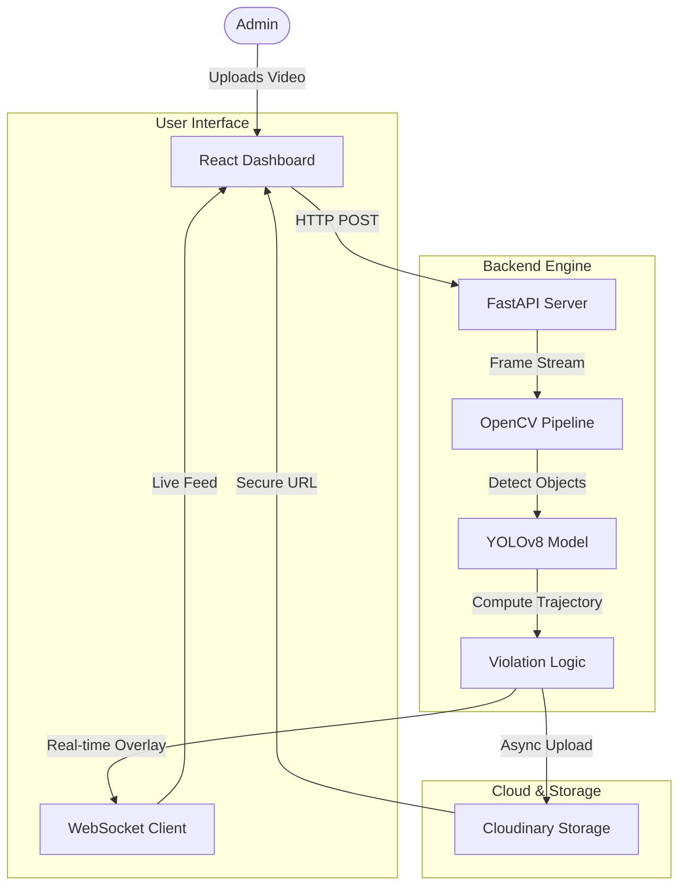

# 🚦 TrafficGuard AI: Next-Gen Traffic Intelligence


> **TrafficGuard AI** is an enterprise-grade traffic monitoring system that harnesses the power of Deep Learning to detect Wrong-Way driving violations in real-time. It provides instant alerts, cloud-backed evidence storage, and professional forensic reporting.

---

## 🏗️ Architecture & Workflow

This system utilizes a **Reactive Hybrid Architecture**, combining a high-performance Python inference engine with a responsive React dashboard.



---

## ✨ Key Features

### 🧠 Core Intelligence
*   **YOLOv8 Nano/Small**: Optimized for speed, running real-time detection on standard hardware.
*   **ByteTrack Algorithm**: Robust vehicle tracking that maintains ID across occlusions.
*   **Dynamic Flow Analysis**: Automatically determines traffic direction or accepts manual overrides.

### 🛡️ Violation Detection
*   **Wrong-Way Alerts**: Instantly flags vehicles moving against the flow.
*   **Smart Seek**: "View Clip" buttons instantly jump to the exact second a violation occurred.
*   **Evidence Locking**: Snapshots and video clips are preserved for audit.

### ☁️ Enterprise Cloud Capability
*   **Cloudinary Integration**:
    *   Automatic async upload of processed sessions.
    *   No local storage limits – evidence is safely stored in the cloud.
    *   Secure, signed URLs for video playback.

### 📊 Forensic Reporting
*   **Live Dashboard**: Real-time counter for Total Vehicles, Wrong-Way Incidents, and Average Speed.
*   **CSV Export**: Download legally-compliant detailed logs including timestamps and vehicle IDs.
*   **Responsive UI**: Modern Material-UI (MUI) design ensuring usability on all devices.

---

## 📂 Project Structure

A guide to the codebase to help you navigate:

| Folder | Status | Description |
| :--- | :--- | :--- |
| `backend/` | **Core** | Contains all Python logic, API, and AI processing. |
| `frontend/` | **Core** | React application, UI components, and Dashboard logic. |
| `backend/uploads/` | *Temp* | Temporary storage for raw video uploads (safe to clear). |
| `backend/processed_videos/` | *Temp* | Temporary storage for processed videos before Cloud upload. |
| `backend/generated_violations/` | *Temp* | Temporary folder for violation snapshots. |
| `backend/__pycache__/` | *Ignored* | Python compiled files (do not commit). |
| `frontend/node_modules/` | *Ignored* | NPM dependencies (do not commit). |

> **Note on `postcss.config.js`**: This file configures **PostCSS**, a tool used by Tailwind CSS and Vite to process CSS. It adds vendor prefixes (like `-webkit-`) automatically, ensuring your styles work on all browsers. **Do not delete it.**

---

## 🚀 Installation & Setup

### Prerequisites
*   **Python 3.10+** (Required for Ultralytics)
*   **Node.js 18+**

### 1. Backend Setup
```bash
cd backend

# Create Virtual Environment (Optional but Recommended)
python -m venv venv
# Windows: venv\Scripts\activate
# Mac/Linux: source venv/bin/activate

# Install Dependencies
pip install -r requirements.txt

# Configure Environment
# Create a .env file with your Cloudinary Credentials:
# CLOUDINARY_CLOUD_NAME=...
# CLOUDINARY_API_KEY=...
# CLOUDINARY_API_SECRET=...

# Run Server
python main.py
```
*Server runs at `http://127.0.0.1:8000`*

### 2. Frontend Setup
```bash
cd frontend

# Install Dependencies
npm install

# Start Dev Server
npm run dev
```
*Dashboard runs at `http://localhost:5173`*

---

## 🛡️ Security Note for GitHub
This repository is configured with a `.gitignore` file to **prevent** uploading:
*   ❌ Your API Keys (`.env`)
*   ❌ Large Video Files (`uploads/`, `*.mp4`)
*   ❌ System Folders (`__pycache__`, `node_modules`)

**You are safe to push this code to GitHub.**

---

## 🤝 Contribution
1.  Fork the Project
2.  Create your Feature Branch (`git checkout -b feature/AmazingFeature`)
3.  Commit your Changes (`git commit -m 'Add some AmazingFeature'`)
4.  Push to the Branch (`git push origin feature/AmazingFeature`)
5.  Open a Pull Request

---

### © 2025 TrafficGuard AI
*Ensuring Safer Roads Through Intelligence.*
